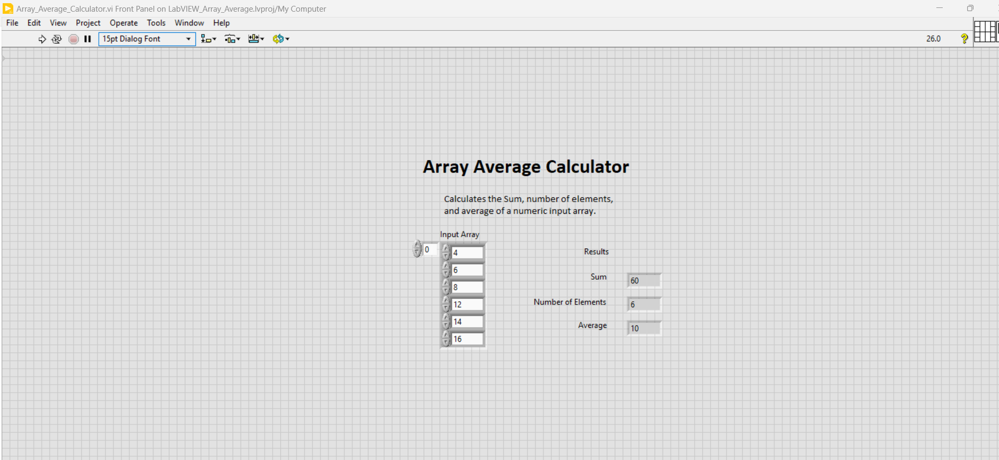
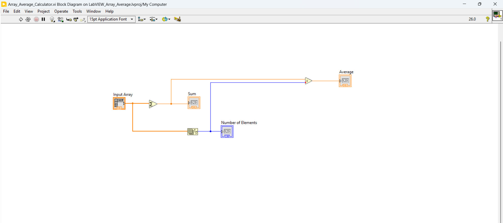

# LabVIEW Array Average Calculator

A simple LabVIEW project that calculates the **sum**, **number of
elements**, and **arithmetic average** of a user-defined numeric array.

## Overview

The VI accepts a numeric array as input and dynamically calculates:

-   Sum of all array elements
-   Number of elements in the array
-   Average of the array elements

The number of input elements is not fixed. The VI uses the **Array
Size** function to determine the number of elements at runtime.

## Example

For the input array:

``` text
[1, 4, 5, 6, 7, 8]
```

The VI calculates:

``` text
Sum = 31
Number of Elements = 6
Average = 5.16667
```

## VI Logic

``` text
Input Array
     │
     ├──► Add Array Elements ──► Sum ──────────┐
     │                                         │
     └──► Array Size ──────────► Number of     │
                                  Elements     │
                                               ▼
                                    Sum ÷ Number of Elements
                                               │
                                               ▼
                                            Average
```

## LabVIEW Concepts Demonstrated

-   Numeric arrays
-   Array Size
-   Add Array Elements
-   Numeric data types
-   Basic arithmetic operations
-   Dataflow programming
-   Front Panel controls and indicators
-   Block Diagram wiring

## Project Structure

``` text
LabVIEW-Array-Average-Calculator/
│
├── LabVIEW_Array_Average.lvproj
├── Array_Average_Calculator.vi
├── README.md
│
└── Screenshots/
    ├── Front_Panel.png
    └── Block_Diagram.png
```

## Requirements

-   NI LabVIEW
-   A LabVIEW version compatible with the saved VI/project

No external libraries, hardware, DLLs, or third-party dependencies are
required.

## How to Run

1.  Open `LabVIEW_Array_Average.lvproj` in LabVIEW.
2.  Open `Array_Average_Calculator.vi`.
3.  Enter numeric values in the **Input Array**.
4.  Run the VI.
5.  View the calculated **Sum**, **Number of Elements**, and **Average**
    in the Results section.

## Screenshots

### Front Panel



### Block Diagram



## Purpose

This project was created as a hands-on LabVIEW learning exercise to
demonstrate fundamental concepts of array processing, numeric
operations, and LabVIEW dataflow programming.
